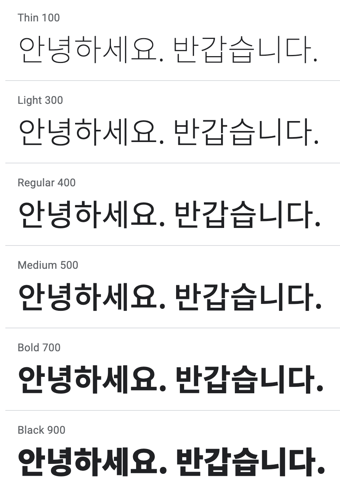

# POG - Material

## Frontend

### Layout

- Breakpoint

| Device  | Breakpoint |
| ------- | ---------- |
| Mobile  | ~ 350px    |
| Tablet  | ~ 600px    |
| Desktop | 1024px ~   |

- Columns

| Device  | Columns | Margins / Gutters |
| ------- | ------- | ----------------- |
| Mobile  | 4       | 16px              |
| Tablet  | 8       | 16px              |
| Desktop | 12      | 24px              |

- Spacing

| Element        | px  |
| -------------- | --- |
| All Components | 8px |
| Icon, Type     | 4px |

### Typography

- Reference

- Noto Sans KR

### Color

| Order        | Hex     |
| ------------ | ------- |
| Background   | #FFFFFF |
| Primary      | #9CCC65 |
| Primary-Dark | #8BC34A |
| Secondary    | #FF8A65 |
| Font         | #000000 |
