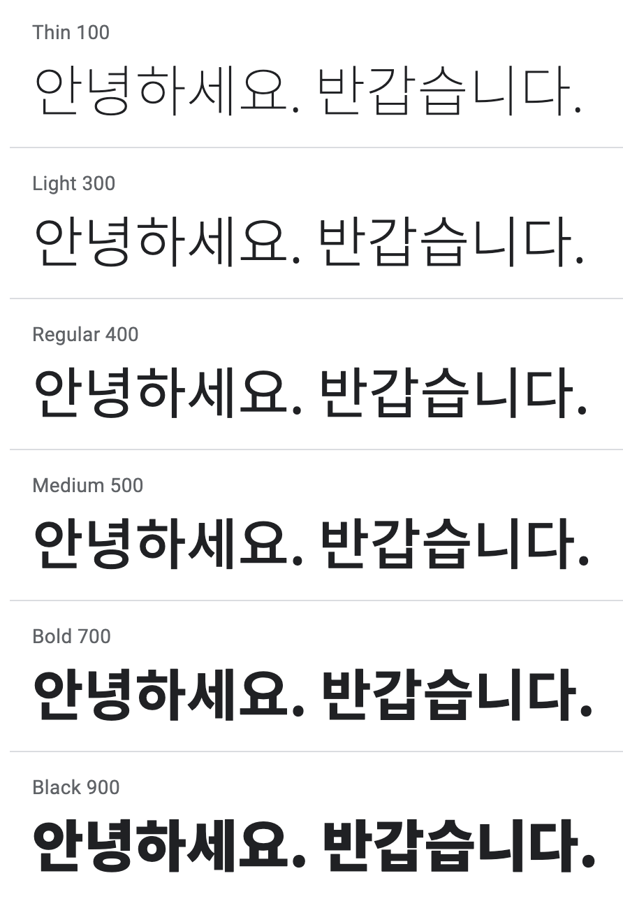

# POG - Material

## Frontend

- Next.js

- styled-components

- Material UI Icons

### Layout

- Breakpoint

| Device     | Breakpoint  |
| ---------- | ----------- |
| Mobile     | ~ 375px     |
| ~~Tablet~~ | ~ ~~600px~~ |
| Desktop    | 1024px ~    |

- Columns

| Device     | Columns | Margins / Gutters |
| ---------- | ------- | ----------------- |
| Mobile     | 4       | 16px              |
| ~~Tablet~~ | ~~8~~   | ~~16px~~          |
| Desktop    | 12      | 24px              |

- Spacing

| Element        | px  |
| -------------- | --- |
| All Components | 8px |
| Icon, Type     | 4px |

### Typography

- Reference

- Noto Sans KR

### Color

| Order          | Hex     |
| -------------- | ------- |
| Background     | #ffffff |
| Sub Background | #f3f5f9 |
| Primary        | #ff577f |
| Font           | #000000 |
| Border, Hover  | #e0e0e0 |
| Placeholder    | #bebebe |

 

## Backend

- Express.js
